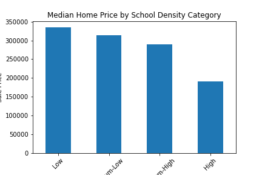

# Project Miami Housing
​
## Description
​
For this project, we built a replicable analysis to help determine the impact of various factors on housing prices. To ensure that we had sufficient data for our initial analysis, we opted to study Miami housing data from 2016. This project can serve as a proof of concept for investigating our hypotheses; if desired, we could extend this analysis to housing data for the U.S. as a whole, and ultimately globally. 
​
- To establish our research hypotheses, we selected a range of factors that we thought may have an impact on home sale price in Miami: 
    Home features (inherent to the property)
    Square footage of the home 
    Special features of the home (e.g., pools)
    Distance to the ocean
- Location in the city as measured by zip codes 
- External factors of a neighborhood 
    Number of schools within a 1km radius of the home
    Number of hospitals within a 5km radius of the home 
    Number of restaurants within a 1km radius of the home 
​
​
## Team members
Vidya, Brandon, Jen, Emma, Fidel
​
## Setup Instructions
- Make a copy of config.py.dev and rename it config.py
- Paste your own Geoapify key in config.py
​
## Data Sources
- Kaggle https://www.kaggle.com/datasets/deepcontractor/miami-housing-dataset 
- GEOAPIFY https://apidocs.geoapify.com/docs/places/#about, https://apidocs.geoapify.com/docs/place-details/#place-details 
​
​
## Data flow of the project (E2E Data Pipeline)-
​
- Miami housing sample 01. - Take sample from complete dataset and save css file
- Miami fetch postcode 02 - Fetch post codes from API
- Miami api calls 03 - Fetch restaurants, schools and hospitals data and merge with dataset
### Miami_Hypothesis_04 
- This jupyter notebook consists of code which provides details about how sample which is used in analysis represents complete dataset. We have plotted histogram for both sample and complete dataset and calculated mean, median and mode value. Finally, We have used T test show the p-value. Along with that, We have also plotted scatter plot for various factor such as total living area, sqaure footage, special feature value, ocean distance and age of the house versus house sales price. In order to calculate exact values, we have used linera regression model and calculated the corr value. 
### Miami zip code hypothesis 05:
 This jupyter notebook analyzes home sales data for Miami zip codes and looks at the most expensive zips versus most home sales zips
​
 - We hypothesized that the most expensive zip codes would be different from the zip codes with the highest quantity of home sales. To test this we grouped the data by zip code and calculated the median sales price as well as the count of homes.  

Zip Code Findings:
* None of the zip codes with the highest quantity of sales are in the top 10 most expensive zip codes in Miami.
* For deeper analysis, we could compare the sales price ranking to the quantity of homes sold in each Miami zip code area.
​
​
- Miami ext factor hypothesis 06 - External factors such as schools, hospital and restaurants significance on sales price
​
# Conclusions:
​
## Which internal factor of house affects the house sales price the most?
​
After considering the data such as total living area, square footage, special feature value, ocean distance and age of the house, we can conclude that the most correlated attribute with house price is total living area as per data with a value of 0.6 and then special feature value with correaltion value of 0.4 and square footage with value of 0.29 . Along with these, there are the two attributes age and ocean to distance which are negatively correalted with value of -0.12 and -0.24. 

## What impact does school density have on home sale price? 

We hypothesized that the number of schools within a one kilometer radius of a home would be positively correlated with the sale price of the home. To begin testing this hypothesis, we gave each home a school density ranking based on the number of schools within one kilometer: Low (0-1), Medium-Low (2-5), Medium-High (6-10), and High (11-25). We then grouped our data to determine both the median price of homes and the percent of home sales associated with each ranking. 

In the first figure below, we see the median sale price of a home for each school density ranking; the data does not appear to disprove the null hypothesis, as (perhaps counterintuitively), median home price is highest among homes with the lowest school density rankings. The second figure below tells a similar story, with homes ranked as Low and Medium-Low in school density account for over two-thirds of the home sales in our data sample. This merits further investigation, as our analysis did not account for school rankings. We also have not investigated school board policy in the Miami-Dade school district. Perhaps the district is more likely to add or establish schools in historically disadvantaged neighborhoods that are not as desirable from a real estate standpoint. 

/Images/sales_count_school_density_pie.png)

## What impact does restaurant density have on home sale price? 

As with schools, we similarly hypothesized that the number of restaurants within a one kilometer radius of a home would be positively correlated with the sale price of the home. To begin testing this hypothesis, we gave each home a restaurant density ranking based on the number of restaurants within one kilometer: Low (0-3), Medium-Low (4-10), Medium-High (11-15), and High (16-25). We then grouped our data to determine both the median price of homes, the percent of home sales, and the total sales associated with each ranking. 

In the first figure below, we see the median sale price of a home for each restaurant density ranking; the data appears to challenge the null hypothesis, though more analysis needs to be done. Homes with the highest restaurant density ranking have the highest median sale price. Interestingly, the number of sales (second figure below) and the total sales (third figure below) are greatest for homes with the lowest restaurant density ranking. This may say just as much about the significant price disparity in the housing market in Miami as it does about the impact of restaurant proximity to a home and its sale price. Still, there appears to be a greater positive correlation between a home’s sale price and the number of restaurants nearby than between a home’s sale price and the number of schools nearby. 

/Images/sales_median_restaurant_density_bar.png)

/Images/sales_count_restaurant_density_pie.png)

/Images/sales_total_restaurant_density_pie.png)
